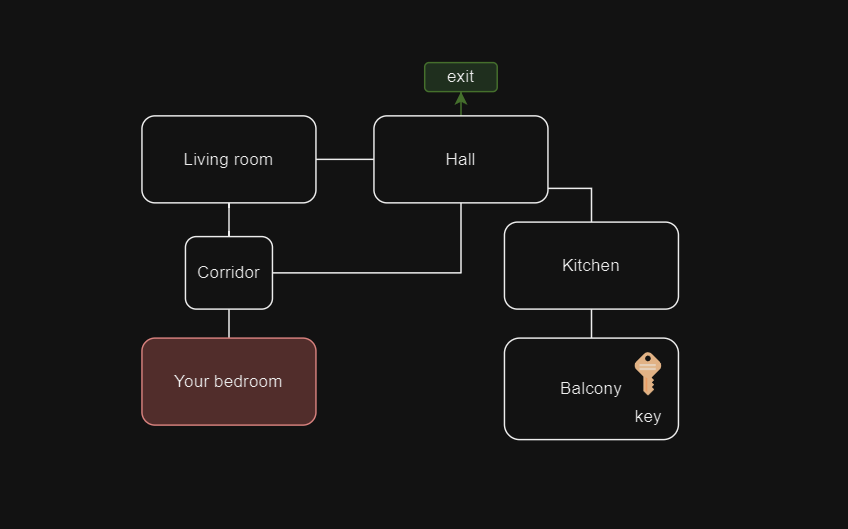

# MDE Text Game
A simple game where the interraction and the game logic is made using MDE approach with the EMF tools.

# What's next ?
- [x] Modelize the entities and relationships between them
- [ ] Modelize the game logic
- [ ] Add a simple GUI for the game

  